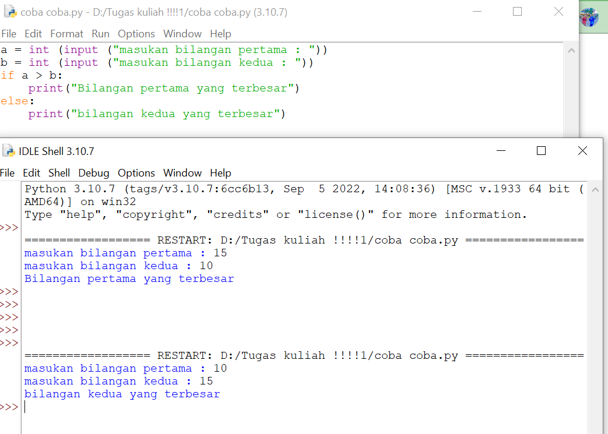
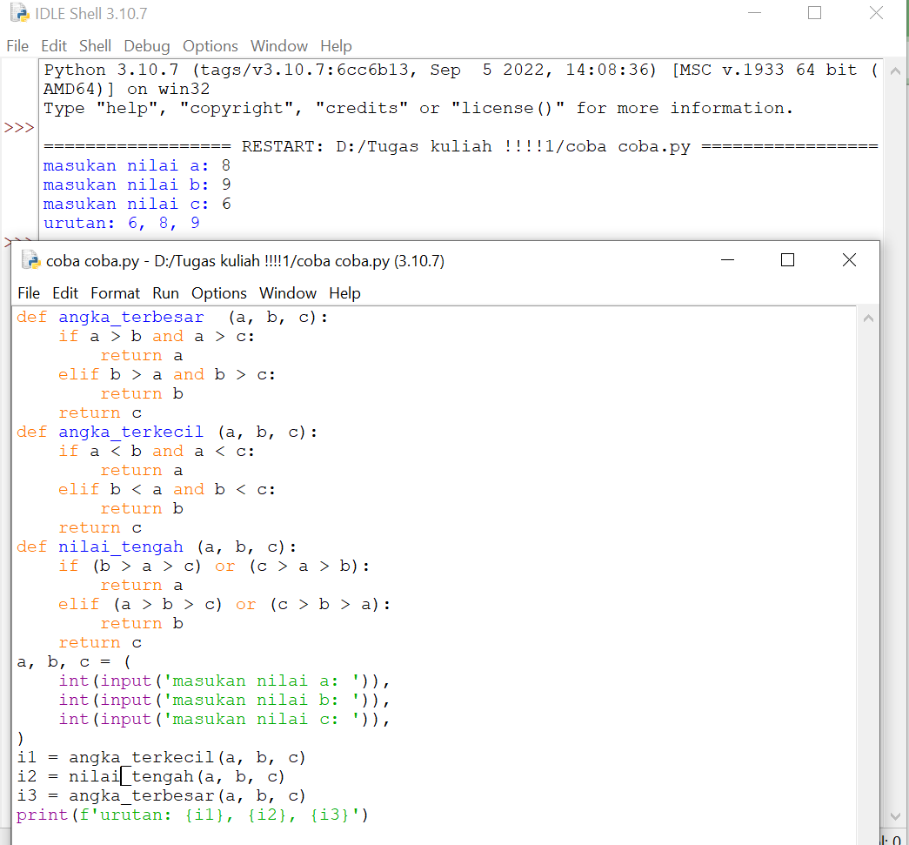
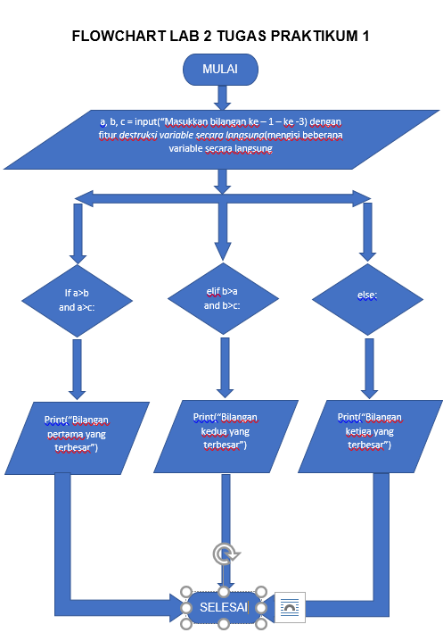
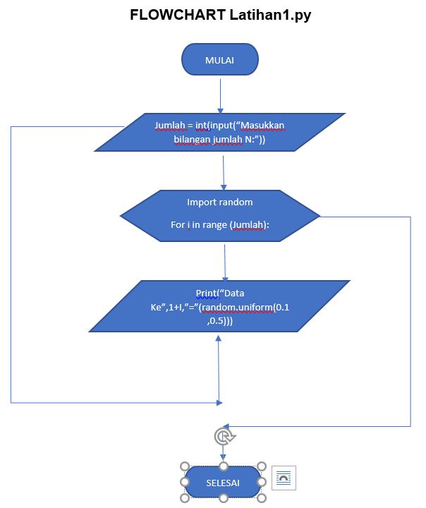
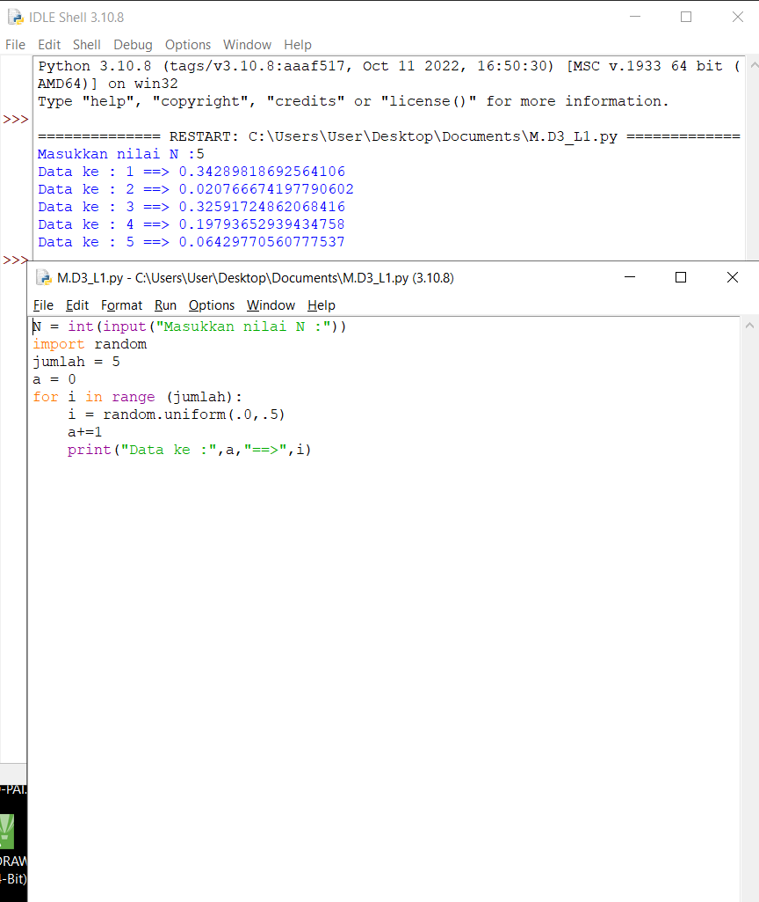
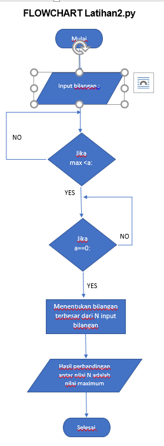
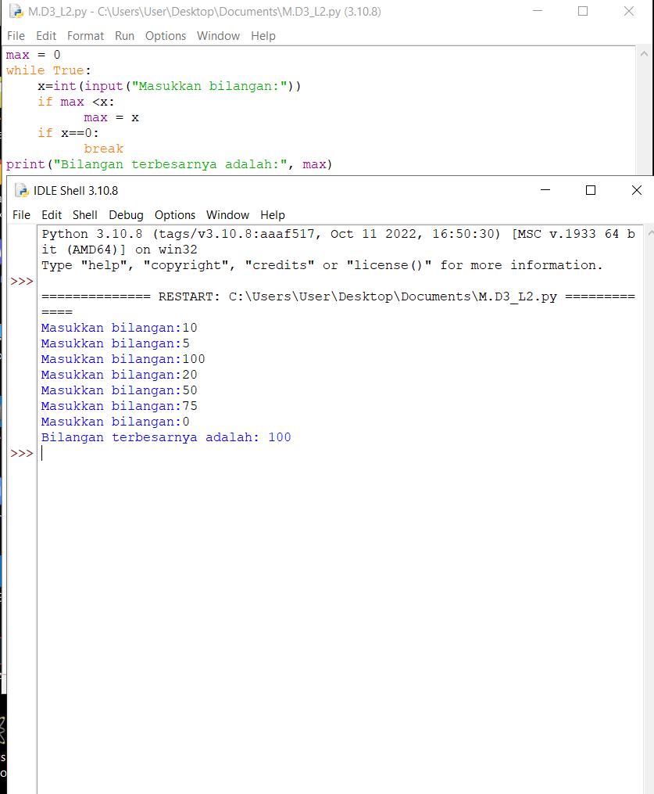
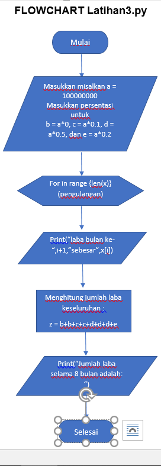
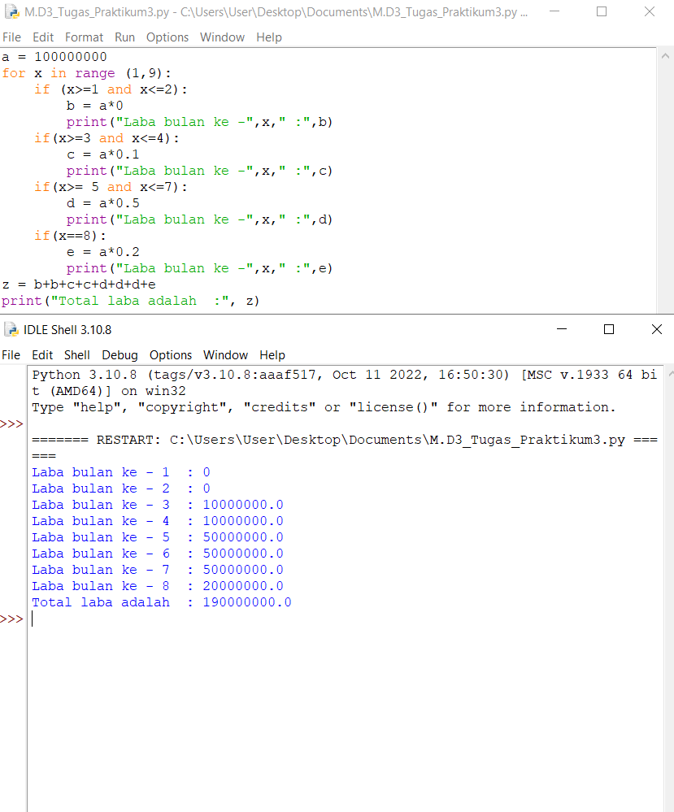

# Latihan 4
# Lab 1 
## Tugas 1 
- Buat program sederhada dengan input 2 buah bilangan, kemudian tentukan bilangan terbesar dari kedua bilangan tersebut
menggunakan statement if.

## Tugas 2 
- Buat program untuk mengurutkan data berdasarkan input sejumlah data (minimal 3 variable input atau lebih), kemudian tampilkan hasilnya secara berurutan mulai dari data terkecil.

## Tugas 3
- Buat program dengan perulangan bertingkat (nested) for yang menghasilkan output sebagai berikut:

## Tugas 4
- Tampilkan n bilangan acak yang lebih kecil dari 0.5.
- Nilai n diisi pada saat runtime
- Anda bisa menggunakan kombinasi while dan for untuk menyelesaikannya

# Lab 2
## Tugas Praktikum 2
- Buat program sederhana dengan input tiga buah bilangan, dari ketiga bilangan tersebut tampilkan bilangan terbesarnya. Gunakan statement if.

- Uraikan langkah atau algoritmanya pada file README.md, sertakan juga flowchart dan screenshot hasil eksekusi program. Tampilkan 3 kondisi inputan data.

- Jadi kita disuruh untuk mencari nilai terbesar dari ketiga nilai variabel
- Pertama-tama, kita menentukan 3 variabel terlebih dahulu
- Setelah dtentukan, ekpresikan dengan memasukkan inputan
- Lalu kita membandingkan mana bilangan yang terbesar dari ketiga nilai variabel
- Ekpesikan dengan membuat satu statemen dan ekpresi pada setiap variabel
# Lab 3 
## Latihan1.py

- Pertama-tama, Deklarasi dan beri inputan ke variabel dalam bentuk intreger. Saya menggunakan variabel N
- Lalu menggunakan pengimport random untuk memberi nilai variabel secara acak
- Memberi batasan dengan memberi variabel baru , jumlah yang bernilai 5 
- Membuat kondisi menggunakan if dengan range(jumlah)
- Setelah selesai membuat kondisi, ekspresikan hasil kondisi yang telah kita buat

## Latihan2.py

- Pertama-tama, kita menggunakan maximum yang dioperasikan sebagai :

max = 0

- Lalu menggunakan kondisi while dengan ketetapan yang pasti
- Kita menggunakan variabel x yang dioperasikan sebagai :

x = int(input("Masukkan bilangan:"))

- Memberi kondisi kepada max jika :

if Max < x:
  Max = x

- Dan variabel x diberi kondisi juga

if x==0:

- Seletah kondisi akhir, kita menggunakan break untuk memberhentikan adanya pengulangan 
- Ekspresikan hasil statent dan kondisi yang telah dibuat

## Pemograman1.py

- Pertama-tama, kita tentukan variabel dengan diberi nilai semisal :

a = 100000000

- Lalu kita menggunakan kondisi dimana akan dilakukan statement berulang selama 9 kali dengan : 

for x in range (1, 9)

- Pada bulan pertama dan kedua, laba yang didapat yaitu 0%
- Bulan kedua dan ketiga, laba yang didapat sebesar 1%
- Bulan keempat sampai dengan bulan ketujuh, laba yang didapat mengalami kenaikan 4% menjadi 5%
- Bulan kedelapan mengalami penurunan sebesar 3%, mendapat laba sebesar 3%
- Setelah mengetahui laba selama 8 bulan, tambahkan semua untuk mendapatkan total laba selama 8 bulan
- Lalu ekspresikan hasil statement dan kondisi yang telah dibuat

